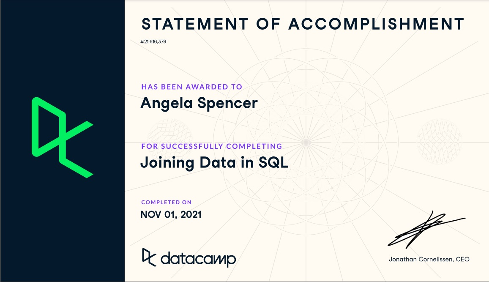

# Week_07
Week 07 - SQL Part 2

Autoincrementing:
AUTO-INCREMENT creates a unique number that fills a column when a new row is created. The default starting value is 1 and the default increment adds 1 with every new record

Join vs Subquery:
Joins and subqueries can often be used to answer the same questions.  Joins work best for performing simple operations and aggregate functions while subqueries can perform more complicated operations and avoid the need to GROUPBY all non aggregate fields.  Joins may require less computing power than subqueries as well.

Joining Data in SQL:

References:
https://www.sqlstyle.guide/

https://www.essentialsql.com/what-is-the-difference-between-a-join-and-subquery/

https://mode.com/sql-tutorial/sql-window-functions/#ntile

https://www.codeproject.com/Articles/34142/Understanding-Set-based-and-Procedural-approaches

https://www.w3schools.com/sql/sql_autoincrement.asp